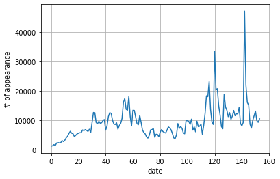
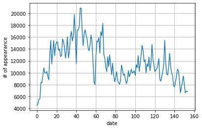
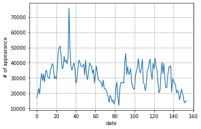
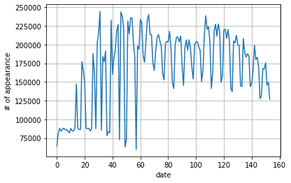
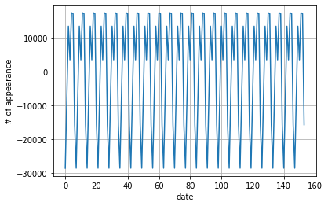
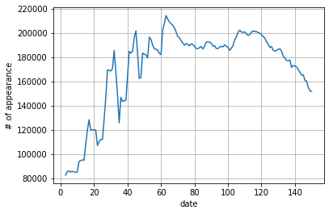
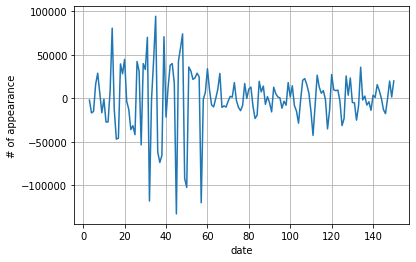
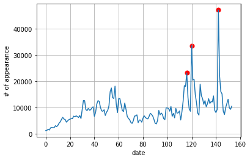
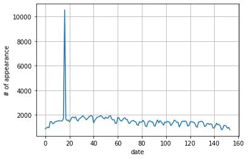

# Trending Event Detection
----
By Jane, <span style="color:red">DO NOT SHARE</span>

## Introduction

We work on a dataset from Twitter. The ultimate goal is to identify the trending event over time and find out the corresponding tweets.

During this project, we build a machine learning pipeline to achieve this goal.
The tasks in this project include:
- Data Pre-processing and Exploratory Data Analysis (EDA)
- Anoamly Detection Algorithm Implementation
- Trending Event Detection using Anomaly Detection
- Retrieve tweets related to trending event


Skills included:
- The time-series anomaly detection algorithm 
- Detecting trending event using time-series anomaly detection
- Related Python libraries and the machine learning library

## High-level Idea of Event Detection

To detect the trending events in our dataset, we do the following steps:
- Firstly, we will parse the collected tweets and extract the keywords and key phrases from them.

- Secondly, for each top keyword or key phrase, we will construct a time-series (daily) based on its number of appearance in the twitter stream.

- Next, we will apply the anomaly detection algorithm against the timeseries of each keyword or key phrase, and mark the dates when that keyword or key phrase is identified as *anomaly*.

- Finally, we group the keywords and key phrases together by the dates when they are detected as *anomaly*. 

Therefore, for each date, by combing all the keywords and key phrases that are anomalous in terms of number of appearances, we can have an idea of what topics are trending on that date.

## Dataset

Let's first get familiar with the datasets, this time we have processed the raw text data for you, so you can focus more on the model and algorithm side.


The data is organized by date in it (from **2020-03-22** to **2020-08-22**), within each subfolder, find following files:

|Filename|Description|
|---|---|
|DATE_top1000bigrams.csv | Top 1000 bi-grams ordered by counts from the tweets |
|DATE_top1000terms.csv   | Top 1000 terms ordered by counts from the tweets |
|DATE_top1000trigrams.csv| Top 1000 tri-grams ordered by counts from the tweets  |


### Environment Setup

Please use Python3.6+, have following Python library installed:
- numpy
- scipy
- statsmodels
- NLTK
- matplotlib


```python


!pip3 install nltk
```

    Requirement already satisfied: nltk in /Library/Frameworks/Python.framework/Versions/3.8/lib/python3.8/site-packages (3.5)
    Requirement already satisfied: joblib in /Library/Frameworks/Python.framework/Versions/3.8/lib/python3.8/site-packages (from nltk) (0.15.1)
    Requirement already satisfied: regex in /Library/Frameworks/Python.framework/Versions/3.8/lib/python3.8/site-packages (from nltk) (2020.11.13)
    Requirement already satisfied: click in /Library/Frameworks/Python.framework/Versions/3.8/lib/python3.8/site-packages (from nltk) (7.1.2)
    Requirement already satisfied: tqdm in /Library/Frameworks/Python.framework/Versions/3.8/lib/python3.8/site-packages (from nltk) (4.54.0)
    WARNING: You are using pip version 20.2.4; however, version 21.2.1 is available.
    You should consider upgrading via the '/Library/Frameworks/Python.framework/Versions/3.8/bin/python3.8 -m pip install --upgrade pip' command.


```python
%matplotlib inline
from typing import List, Dict, Optional
from datetime import date, timedelta
from collections import Counter, defaultdict

import json
import re
import nltk
from nltk.corpus import stopwords
import matplotlib.pyplot as plt
```


```python

```


```python
# download the stopwords package from NLTK


import nltk
import ssl

try:
    _create_unverified_https_context = ssl._create_unverified_context
except AttributeError:
    pass
else:
    ssl._create_default_https_context = _create_unverified_https_context
    
nltk.download('stopwords')


```

    [nltk_data] Downloading package stopwords to
    [nltk_data]     /Users/yangzhengjie/nltk_data...
    [nltk_data]   Package stopwords is already up-to-date!


    True


```python
# Get the stopwords list from NLTK
stop_words = set(stopwords.words('english'))
```

Have a look on what stopwords are provided by NLTK,


```python
print(len(stop_words))
```

    179


```python
# TODO (optional): You can always come back add any custom stopwords 
#                  here to improve the quality of final results
custom_stopwords = ['nan',]
```


```python
stop_words.update(custom_stopwords)
```

## Data Pre-processing and Exploratory Data Analysis (EDA)

In this first task, we will need to build the time-series for the key words and key phrases in tweets. For simplicity, we will use the term token to represent either terms or bigrams or trigrams in our dataset.

- We have tweet token counts from 2020-03-22 to 2020-08-22, let's pick top 500 eligible tokens based on all time high counts (e.g., if a token appears in multiple days, we use the highest count as its all time high count) as our selected tokens in each of these 3 files.
- For the selected tokens from each of the 3 files, we build daily time-series from 2020-03-22 to 2020-08-22 (the value will be the number of appearance on each date given in the file), so you will have 1500 time-series after the data pre-processing.

Here are the requirements for eligible token:
- Token should be converted the token to lower case.
- Eligible token should at least have 3 letters.
- Eligible token should consist of alphabet characters or numbers, but not only numbers (you can use the Python3 string `.isalnum()` and `.isdigit()` functions)
- Eligible token should not be stopwords (you can filter them out using the defined `stop_words` set)


```python
# Start date and end date of the datasets
start_dt = date(2020,3,22)
end_dt = date(2020,8,22)
```


```python
# This counter is used to figure out each token's highest count (i.e., all time high count)
terms_counter = Counter()

# This dict to remember the count of each token in each daydaily_counts[]
# usage: daily_counts[date_string][token_string], e.g. daily_counts['2020-04-01']['covid19']
daily_counts = defaultdict(dict)

# This dict to remember the mininum count among all token in each day
# this dict is used to fill the missing value if one token does not appear in some other date
daily_min_counts = {}
```


```python
dt = start_dt
while dt <= end_dt:
    daily_min_counts[dt] = float('inf')
    # iterating through entire datasets
    with open(f'./dataset/{dt.isoformat()}/{dt.isoformat()}_top1000terms.csv', 'r') as f:
        for line in f.readlines():
            token, count = line.strip().split(',')
            count = int(count)
            
            # 1. token should be converted the token to lower case.
            # 2. token should at least have 3 letters.
            # 3. token should consist of alphabet characters or numbers, but not only numbers
            # 4. token should not be stopwords
            if ((len(token)>2) and (token not in stop_words) and (token.isalnum()) and (token.isdigit() == False)):
                term = token.strip().lower()  
            
            # TODO: Fill the terms_counter, daily_counts and daily_min_couts
            dt_str = dt.isoformat()
            if term:
                terms_counter[term] = max(terms_counter[term],count)
                daily_counts[dt][term] = count
                daily_min_counts[dt] = min(daily_min_counts[dt],count)
            
            
    dt += timedelta(days=1)
```


```python
print(f'Number of eligible tokens: {len(terms_counter)}')
print(f'Top N tokens with counts:\n{terms_counter.most_common(5)}')
```

    Number of eligible tokens: 4114
    Top N tokens with counts:
    [('coronavirus', 365236), ('covid', 255660), ('covid19', 248841), ('trump', 75936), ('cases', 60019)]


```python
# TODO (optional): You can decide how many tokens you want to use, default is 1000
topN = 1000
```


```python
# Use Counter.most_common(N) function to select topN eligible tokens
selected_tokens = [x for x, _ in terms_counter.most_common(topN)]
```


```python
selected_tokens[:100]
```


    ['coronavirus',
     'covid',
     'covid19',
     'trump',
     'cases',
     'people',
     'amp',
     'new',
     'vaccine',
     'via',
     'pandemic',
     'polmascegahcovid19',
     'siagalawancovid19',
     'bolsonaro',
     'deaths',
     'lockdown',
     'china',
     'dalam',
     'dan',
     'virus',
     'realdonaldtrump',
     'news',
     'russia',
     'partisipasicegahcovid19',
     'putin',
     'may',
     'vacuna',
     'health',
     'data',
     'like',
     'get',
     'one',
     'stay',
     'world',
     'disinfectant',
     'positive',
     'masyarakat',
     'first',
     'rally',
     'testing',
     'covidー19',
     'home',
     'florida',
     'crisis',
     'help',
     'easter',
     'support',
     'time',
     'mask',
     'cain',
     'casos',
     'baksospolripeduli',
     'pemerintah',
     'death',
     'penyebaran',
     'ayoikutiaturan',
     'day',
     'work',
     'twitter',
     'would',
     'herman',
     'yang',
     'president',
     'need',
     'know',
     'doctors',
     'video',
     'tulsa',
     'masks',
     'workers',
     'adalah',
     'polri',
     'membantu',
     'oxford',
     'cdc',
     'memerangi',
     'covid2019',
     'untuk',
     'hydroxychloroquine',
     'cummings',
     'jiwakemanusiaanpolri',
     'could',
     'government',
     'today',
     'lockdown2020',
     'schools',
     'says',
     'corona',
     'mudik',
     'please',
     'terdampak',
     'state',
     'des',
     'kita',
     'coronaviruspandemic',
     'test',
     'going',
     'patients',
     'see',
     'died']


build the timeseries for all of them


```python

# timeseries variable is used to store all the tokens and their timeseries in key, value format,
# find a token's timeseries by querying the `timeseires` dict
timeseries = defaultdict(list)

# Since all the timeseries should have same timetamps range, we put them into this `ts_idx` list
ts_idx = []
```


```python
dt = start_dt
while dt <= end_dt:
    dt_str = dt.isoformat()
    ts_idx.append(dt_str)
    for token in selected_tokens:
        #       construct the timeseries using `daily_counts`
        #       if a token does not have count for that date,
        #       use that day's minimum count minus 1 to fill it
        if daily_counts[dt].get(token) is not None:
            timeseries[token].append(daily_counts[dt][token])
        else:
            timeseries[token].append(daily_min_counts[dt]-1)
            
    dt += timedelta(days=1)
```


```python
print(ts_idx[:10])
print(len(ts_idx))
```

    ['2020-03-22', '2020-03-23', '2020-03-24', '2020-03-25', '2020-03-26', '2020-03-27', '2020-03-28', '2020-03-29', '2020-03-30', '2020-03-31']
    154


```python
print(timeseries['covid'])
```

    [64625, 81299, 87927, 84130, 86337, 88211, 85666, 86045, 84245, 81883, 87801, 84289, 84508, 88115, 147042, 88191, 86294, 86159, 177003, 165238, 149204, 87796, 87441, 87872, 84300, 87832, 188075, 162115, 87533, 202177, 215341, 244463, 85161, 184007, 176959, 191668, 78109, 83345, 82026, 232681, 160025, 181829, 193076, 218040, 226726, 72617, 243692, 237600, 221695, 62944, 72995, 231589, 214502, 235946, 235463, 203197, 183314, 59663, 198124, 193825, 233720, 229764, 184729, 176203, 204385, 233083, 240133, 213401, 213041, 175263, 165413, 191270, 208844, 213502, 205036, 198248, 160974, 152674, 201153, 204190, 203239, 217747, 195240, 149118, 141077, 199463, 210100, 210021, 203584, 211505, 171033, 145184, 195486, 206215, 192321, 206427, 195015, 169706, 153927, 200065, 203613, 203746, 196797, 192116, 150395, 166085, 214526, 238524, 220280, 223908, 203045, 141182, 162408, 218255, 227139, 211307, 227539, 217091, 149659, 157923, 219258, 220434, 208357, 219940, 204673, 141289, 137167, 204648, 202254, 212540, 199278, 199163, 144470, 144052, 208101, 188929, 183369, 187488, 184978, 143789, 147797, 166129, 199125, 180000, 182850, 169870, 127731, 131656, 167884, 167193, 175596, 145739, 149727, 126809]


check the trends for token `covid`, `vaccine` and `death`


```python
def plot_ts(ts: List[float], labels: List[str] = None) -> None:
    if not labels:
        labels = list(range(len(ts)))
    plt.plot(labels, ts)
    plt.grid()
    plt.xlabel('date')
    plt.ylabel('# of appearance')
    plt.show()

def token_trend(token: str):
    plot_ts(timeseries[token])
```


```python
token_trend('covid')
```


```python
token_trend('vaccine')
```





```python
token_trend('death')
```





```python
# TODO (optional): Feel free to pick any other token that you many want to check its trend as well
token_trend('trump')
```





## Anoamly Detection Algorithm Implementation

In this part, we will implement the anomaly detection algorithm mentioned in this paper: [Automatic Anomaly Detection in the Cloud Via Statistical Learning](https://arxiv.org/pdf/1704.07706.pdf), we also attached a pdf copy in the repo.

This paper introduced a few popular anomaly detection algorithms from Twitter we will implement the **Seasonal Hybrid ESD (Extreme Studentized Deviate)** algorithm mentioned in the paper.


### Seasonal Trend Decomposition


```python
!pip3 install statsmodels
```

    Requirement already satisfied: statsmodels in /Library/Frameworks/Python.framework/Versions/3.8/lib/python3.8/site-packages (0.12.1)
    Requirement already satisfied: scipy>=1.1 in /Library/Frameworks/Python.framework/Versions/3.8/lib/python3.8/site-packages (from statsmodels) (1.4.1)
    Requirement already satisfied: pandas>=0.21 in /Library/Frameworks/Python.framework/Versions/3.8/lib/python3.8/site-packages (from statsmodels) (1.0.3)
    Requirement already satisfied: numpy>=1.15 in /Library/Frameworks/Python.framework/Versions/3.8/lib/python3.8/site-packages (from statsmodels) (1.18.4)
    Requirement already satisfied: patsy>=0.5 in /Library/Frameworks/Python.framework/Versions/3.8/lib/python3.8/site-packages (from statsmodels) (0.5.1)
    Requirement already satisfied: python-dateutil>=2.6.1 in /Library/Frameworks/Python.framework/Versions/3.8/lib/python3.8/site-packages (from pandas>=0.21->statsmodels) (2.8.1)
    Requirement already satisfied: pytz>=2017.2 in /Library/Frameworks/Python.framework/Versions/3.8/lib/python3.8/site-packages (from pandas>=0.21->statsmodels) (2020.1)
    Requirement already satisfied: six in /Library/Frameworks/Python.framework/Versions/3.8/lib/python3.8/site-packages (from patsy>=0.5->statsmodels) (1.15.0)
    WARNING: You are using pip version 20.2.4; however, version 21.2.1 is available.
    You should consider upgrading via the '/Library/Frameworks/Python.framework/Versions/3.8/bin/python3.8 -m pip install --upgrade pip' command.


```python
import numpy as np
import statsmodels.api as sm
from statsmodels.robust.scale import mad
from scipy.stats import t as student_t
```

implement the STL function for you, this function help you decompose the time-series into 3 different components (i.e., seasonal, trend and residual)


```python
def stl(series: np.ndarray, period: int):
    """
    Seasonal-Trend decomposition
    series : numpy.array
        Time-series in ndarry
    periood : int
        Period of the seasonal component.
        For example, if the  time series is monthly with a yearly cycle, then
        freq=12.
    """
    decomp = sm.tsa.seasonal_decompose(series, period=period)
    return decomp.seasonal, decomp.trend, decomp.resid
```

we can use the STL function to decompose the time-sereis for token: 'covid'


```python
seasonal, trend, resid = stl(np.array(timeseries['covid']), period=7)
```


```python
print('Original Timeseries')
plot_ts(timeseries['covid'])
print('Seasonal Component')
plot_ts(seasonal)
print('Trend Component')
plot_ts(trend)
print('Residual Component')
plot_ts(resid)
```

    Original Timeseries





    Seasonal Component





    Trend Component





    Residual Component





### Robust Extreme Studentized Deviate (ESD) Test Algorithm

#### Test statistics
In Robust ESD test, we first define the maximum number of anomalies $K$, and then compute the following test statistic for the $k=1,2,...,K$ most extreme values in the data set:

$$
C_k=\frac{\max_k |x_k-\tilde{x}|}{\hat{\sigma}}
$$

where $\tilde{x}$ is the median of the series and $\hat{\sigma}$ is the median absolute deviation (MAD), which is defined as $\text{MAD} = \text{median}(|X-\text{median}(X)|)$.

To calcuate MAD, I use the mad function from statsmodels (i.e., `from statsmodels.robust.scale import mad`)

#### Critical value
The test statistic is then used to compare with a critical value, which is computed using following equation:

$$
\lambda_k=\frac{(n-k) t_{p,\ n-k-1}}{\sqrt{(n-k-1+t_{p,\ n-k-1}^2)(n-k+1)}}
$$

Note here to compute the $t_{p,\ n-k-1}$ in critical value, I use use following code

```python
from scipy.stats import t as student_t
p = 1 - alpha / (2 * (N - k + 1))
t = student_t.ppf(p, N - k - 1)
```
#### Anomaly direction
The another thing is to determine the direction or the anomaly (i.e., the anomaly is going up or going down), this information is useful because in some anomaly detection task we may only care anomaly goes to only one direction (e.g., for the error count or error rate, we only care if it increases a lot).

To determine the direction of anomaly, I use the sign of the $|x_k-\tilde{x}|$ in $C_k$. If sign is positive, then the anomaly is greater than median and it's very likely to be a spike, otherwise, it should be a dip.

 `robust_seasonal_esd_test` function 


```python
from scipy.stats import t as student_t
from statsmodels.robust.scale import mad
import statsmodels
import math
```


```python
def robust_seasonal_esd_test(ts, max_anom=5, seasonal=False, period=None, alpha=0.05, threshold=1.0):
    """Robust Seasonal Extreme Studentized Deviate Test"""
    series = np.copy(ts)
    
    N = len(series)
    ts_index = np.array(range(N))
    
    if len(ts) != len(ts_index):
        print(f"Bad timeseries, length={len(ts)}")
        return []
    
    
    if seasonal:
        if not period:
            raise RuntimeError("Period must be set if the time series is seasonal")
        # TODO: remove the seasonal signal and median (based on the paper)
        seasonal, trend, resid = stl(series, period=7)
        series = resid
        
    anom_list = []
    n_anom = 0
    
    x_mad = statsmodels.robust.scale.mad(series)
    x_median = np.median(series)
    
    
    for k in range(1, max_anom+1):
        
        
        C_k = np.max(abs(series-x_median)/x_mad) 
        max_idx = np.argmax(abs(series-x_median))
        
        
        
        if (series[max_idx]-x_median) >= 0:
            direction = 'up'
        else:
            direction = 'down'
        
       
        p = 1 - alpha / (2 * (N - k + 1))
        t = student_t.ppf(p, N - k - 1)
        denom = math.sqrt((N - k - 1 + t ** 2)*(N - k + 1))
        lambda_k = (N - k) * t / denom

        # The score is defined as C_k / lambda_k, if the score > threshold,
        # we take this data point as an anomaly
        score = C_k / lambda_k
        if score > threshold:
            n_anom = k
        else:
            break
        
        anom_list.append({
            "rank": k,
            "index": int(ts_index[max_idx]),
            "value": float(ts[ts_index[max_idx]]),
            "direction": direction,
            "score": round(score, 2)
        })
            
        # Remove the identified value from both time-series and index
        series = np.delete(series, max_idx)
        ts_index = np.delete(ts_index, max_idx)
    return anom_list
```


Here we have provided another visualization function to inspect results and a pretty_print function to print dict/list in a more readable way. 


```python
def plot_anomaly_on_ts(ts: List[float], anom_index_list: List[int], anom_value_list: List[int]) -> None:
    """
    Plot timeseries chart together with detected anomalies as scatter points
    ts:
        The values of timeseries
    
    anom_index_list:
        The list of timeseries index for the detected anomalies, for instance, if the 2nd data point
        is identified as anomaly, the index will be 1 (since it starts from 0)
    
    anom_value_list:
        The list of values for the detected anomalies
    """
    labels = list(range(len(ts)))
    plt.plot(labels, ts)
    plt.scatter(anom_index_list, anom_value_list, s=50.0, c='red')
    plt.grid()
    plt.xlabel('date')
    plt.ylabel('# of appearance')
    plt.show()

def pretty_print(struct):
    """
    struct:
        The struct can be anything that is JSON serializable, like dictionary, or list.
    """
    print(json.dumps(struct, indent=2))
```


```python
ts = np.array(timeseries['vaccine'])
anom_list = robust_seasonal_esd_test(ts, threshold=1.0)
pretty_print(anom_list)
anom_index = []
anom_value = []

for anom_dic in anom_list:
    anom_index.append(anom_dic["index"])
    anom_value.append(anom_dic["value"])

plot_anomaly_on_ts(ts, anom_index, anom_value)
```

    [
      {
        "rank": 1,
        "index": 142,
        "value": 47077.0,
        "direction": "up",
        "score": 2.76
      },
      {
        "rank": 2,
        "index": 120,
        "value": 33480.0,
        "direction": "up",
        "score": 1.79
      },
      {
        "rank": 3,
        "index": 116,
        "value": 23138.0,
        "direction": "up",
        "score": 1.05
      }
    ]





## Trending Event Detection using Anomaly Detection

In this part, we will apply the anomaly detection algorithm we have implemented to timeseries of all the token we have obtained in the data preprocessiing step. By connecting anomaly index with actual dates, this will give us each token's "anomaly dates".

If we group tokens by their "anomaly dates", we will know the trending keywords in each date.


```python
print(f'length={len(ts_idx)}')
print(ts_idx[:5])
```

    length=154
    ['2020-03-22', '2020-03-23', '2020-03-24', '2020-03-25', '2020-03-26']


### Apply Anomaly Detection and Group Keywords

Apply the anomaly detection algorithm for the timeseries of all keywords


```python
# Use this dict to remember the anomalous token for each date
# format: daily_anom_tokens[date_string][anomalous_token] = anom_dict_from_the_algorithm
daily_anom_tokens = defaultdict(dict)
```


```python
all_tokens = timeseries.keys()

for token in all_tokens:
    
    ts = np.array(timeseries[token])
    anom_list = robust_seasonal_esd_test(ts, threshold=1.0)
    for anom_dic in anom_list:
        daily_anom_tokens[anom_dic["index"]][token] = anom_dic
    
    
```


```python


for date in sorted(daily_anom_tokens.keys()):
    key_tokens = daily_anom_tokens[date].keys()

    ordered_tokens = []
    for key_token in key_tokens:
        ordered_tokens.append((key_token,daily_anom_tokens[date][key_token]["score"]))
        
    ordered_tokens.sort(key = lambda x: x[1], reverse=True)
    
    # Here we print the token along with its score in descending order
    
    print(date)
    for token, score in ordered_tokens:
        space = ' '*(27-len(token))
        print(f'{token}{space}{score}')
    print()
```

    0
    italian                    4.77
    italy                      4.1
    colleagues                 3.72
    stand                      3.26
    coronaviruspandemic        3.25
    stayathome                 1.65
    friends                    1.62
    recovered                  1.54
    fallecidos                 1.26
    reported                   1.25
    nuevos                     1.08
    muertes                    1.05
    pandemic                   1.02
    salud                      1.02
    
    1
    italy                      2.35
    senate                     1.8
    italian                    1.69
    recovered                  1.49
    democrats                  1.49
    fallecidos                 1.2
    reported                   1.19
    colleagues                 1.1
    stand                      1.09
    muertes                    1.03
    nuevos                     1.0
    
    2
    hantavirus                 4.06
    recovered                  1.46
    self                       1.19
    fallecidos                 1.17
    reported                   1.13
    muertes                    1.01
    
    3
    charles                    7.05
    prince                     6.93
    trillion                   3.66
    senate                     3.53
    stimulus                   3.18
    package                    2.79
    deal                       2.08
    recovered                  1.48
    reported                   1.15
    fallecidos                 1.14
    
    4
    covid2019                  10.24
    package                    2.69
    stimulus                   2.51
    italy                      2.47
    coronaviruspandemic        2.19
    senate                     2.12
    trillion                   1.8
    march                      1.47
    self                       1.43
    ventilators                1.22
    coronavirusoutbreak        1.21
    spain                      1.13
    bill                       1.05
    
    5
    coronalockdown             8.26
    covid2019                  7.35
    boris                      6.54
    yemen                      4.95
    5yearsofwaronyemen         4.11
    aksiberantascovid19        4.1
    johnson                    3.96
    coronavirusoutbreak        3.1
    prime                      2.97
    ventilators                2.73
    italy                      2.3
    trillion                   2.2
    borisjohnson               2.07
    stimulus                   2.01
    saudi                      1.97
    march                      1.52
    hands                      1.48
    self                       1.28
    minister                   1.19
    
    6
    coronalockdown             8.41
    coronaupdate               5.9
    stayathomeandstaysafe      5.3
    coronavirusoutbreak        2.89
    italy                      2.1
    march                      1.44
    available                  1.35
    medical                    1.03
    
    7
    coronaupdate               7.16
    stayathomeandstaysafe      4.5
    deliver                    3.38
    delivered                  3.22
    copy                       3.02
    signing                    2.93
    act                        1.75
    officials                  1.45
    coronalockdown             1.38
    narendramodi               1.25
    ventilators                1.2
    
    8
    coronavirustruth           6.22
    deliver                    1.99
    delivered                  1.83
    march                      1.66
    copy                       1.6
    signing                    1.54
    act                        1.41
    
    9
    sinergitascegahcovid19     8.45
    feb                        4.11
    coronavirustruth           4.02
    tni                        3.94
    penyemprotan               3.87
    jan                        3.7
    stayathome                 3.64
    disinfektan                3.58
    hari                       3.02
    dalam                      2.6
    march                      1.7
    memerangi                  1.66
    ini                        1.41
    socialdistancing           1.03
    
    10
    ang                        4.04
    april                      3.93
    fools                      3.88
    joke                       3.51
    mga                        2.56
    covidー19                   2.47
    jan                        2.2
    feb                        2.14
    
    11
    covid19pandemic            10.66
    optimiscegahcovid19        4.4
    ang                        3.82
    mga                        2.87
    ventilators                1.4
    stayhomesavelives          1.15
    
    12
    covid19pandemic            11.04
    coronaviruspandemic        3.69
    stayhomesavelives          3.34
    google                     2.13
    narendramodi               1.37
    vous                       1.21
    
    13
    coronabisadisembuhkan      9.85
    covid2019                  9.71
    coronaviruspandemic        4.62
    covid19pandemic            3.45
    tetap                      1.83
    stayhomesavelives          1.83
    disiplin                   1.74
    ventilators                1.65
    socialdistancing           1.0
    
    14
    lebihbaikdirumahaja        6.93
    covid2019                  6.73
    tidak                      6.67
    tiger                      6.22
    queen                      4.44
    coronaviruspandemic        3.97
    zoo                        3.66
    rumah                      3.23
    sunday                     2.94
    narendramodi               2.87
    diri                       2.48
    light                      1.98
    prime                      1.4
    stayhomesavelives          1.36
    
    15
    boris                      7.76
    tiger                      5.05
    intensive                  5.0
    johnson                    4.93
    zoo                        3.61
    prime                      3.01
    borisjohnson               2.31
    drug                       1.83
    symptoms                   1.45
    minister                   1.34
    queen                      1.14
    thread                     1.08
    
    16
    worldhealthday             10.72
    polrihimbaupakaimasker     5.62
    boris                      3.51
    masker                     3.24
    nurses                     2.79
    johnson                    2.33
    stayathome                 2.13
    intensive                  2.0
    confinement                1.45
    mail                       1.1
    stand                      1.05
    
    17
    lockdownextension          1.87
    wuhan                      1.77
    confinement                1.66
    twitter                    1.07
    
    18
    ikutiaturancegahcorona     15.47
    mari                       11.72
    rantai                     11.57
    mengikuti                  10.7
    dengan                     6.81
    mata                       6.3
    aturan                     5.53
    memutus                    5.21
    telah                      5.05
    seluruh                    5.05
    penyebaran                 4.87
    kebijakan                  4.84
    bekerja                    4.82
    mencegah                   4.81
    tengah                     4.8
    dukung                     4.8
    bangsa                     4.77
    segala                     4.74
    demi                       4.72
    keras                      4.71
    berupaya                   4.7
    elemen                     4.7
    untuk                      4.69
    memutuskan                 4.6
    bekerjasama                4.59
    usahanya                   4.57
    tetap                      4.51
    ditetapkan                 4.5
    kita                       4.17
    easter                     2.68
    dan                        1.79
    coronavirusoutbreak        1.23
    
    19
    easter                     5.74
    apple                      4.12
    google                     3.57
    friday                     3.14
    covidー19                   2.37
    coronavirusoutbreak        1.75
    york                       1.09
    
    20
    easter                     8.06
    apple                      3.35
    google                     2.91
    stayathome                 1.71
    ppe                        1.55
    
    21
    easter                     24.32
    semuapedulicovid19         11.18
    anak                       10.26
    usps                       9.52
    deliver                    8.66
    delivered                  8.64
    copy                       8.32
    signing                    8.19
    officials                  4.2
    sunday                     4.03
    happy                      3.39
    boris                      3.02
    rantai                     2.77
    mata                       2.09
    last                       2.01
    johnson                    1.98
    nytimes                    1.92
    confinement                1.9
    stayhome                   1.89
    indonesia                  1.73
    support                    1.68
    nhs                        1.04
    
    22
    jiwakemanusiaanpolri       19.4
    jenazah                    13.86
    pasien                     12.53
    jerry                      12.36
    bripka                     12.3
    covid2019                  8.91
    usps                       6.6
    deliver                    6.48
    delivered                  6.4
    copy                       6.01
    signing                    5.88
    terlantar                  5.14
    debt                       4.37
    easter                     4.31
    student                    4.28
    jam                        4.12
    hingga                     4.04
    peduli                     3.89
    urge                       3.66
    package                    3.4
    officials                  3.37
    briefing                   2.81
    confinement                2.45
    needed                     2.16
    anak                       2.15
    last                       1.76
    fauci                      1.7
    dies                       1.69
    support                    1.48
    task                       1.3
    nytimes                    1.3
    diri                       1.23
    press                      1.12
    
    23
    baksostnipolriutknegeri    8.69
    terdampak                  5.31
    sosial                     4.97
    bakti                      4.13
    jiwakemanusiaanpolri       3.68
    debt                       3.67
    funding                    3.35
    briefing                   3.21
    deliver                    3.1
    membantu                   3.08
    jenazah                    3.08
    delivered                  2.91
    student                    2.77
    usps                       2.51
    copy                       2.51
    yang                       2.48
    package                    2.48
    signing                    2.4
    narendramodi               2.35
    urge                       2.16
    pasien                     2.14
    stayhome                   2.01
    officials                  1.67
    jerry                      1.66
    confinement                1.66
    bripka                     1.56
    needed                     1.52
    women                      1.19
    fight                      1.09
    support                    1.08
    dies                       1.08
    press                      1.07
    countries                  1.07
    
    24
    terdampak                  7.08
    polri                      6.3
    masyarakat                 6.04
    baksostnipolriutknegeri    6.0
    funding                    5.24
    tni                        5.08
    sosial                     3.59
    dapurumumtnipolri          3.41
    stimulus                   3.31
    untuk                      2.96
    bakti                      2.69
    yang                       2.23
    cut                        2.21
    oms                        1.92
    officials                  1.19
    check                      1.08
    beban                      1.02
    viral                      1.0
    dangerous                  1.0
    
    25
    ayoikutiaturan             22.74
    jenazah                    11.7
    tidak                      5.07
    pasien                     4.65
    lab                        4.02
    sudah                      4.01
    seharusnya                 3.99
    stimulus                   2.01
    yang                       1.99
    viral                      1.92
    stayathome                 1.86
    facebook                   1.83
    funding                    1.82
    rumah                      1.72
    atau                       1.65
    wuhan                      1.61
    rel                        1.56
    href                       1.55
    nofollow                   1.55
    cut                        1.49
    adalah                     1.3
    true                       1.21
    
    26
    ayoikutiaturan             6.57
    jenazah                    3.73
    wuhan                      2.75
    tidak                      1.85
    toll                       1.02
    gilead                     1.0
    
    27
    togetherathome             4.4
    wuhan                      1.55
    together                   1.12
    
    28
    bersatucekalcovid19        14.75
    jawab                      10.33
    tanggung                   10.3
    bersama                    8.34
    pemerintah                 7.68
    akan                       5.22
    sunday                     4.99
    bukan                      4.79
    hanya                      4.72
    memerangi                  4.48
    tetapi                     4.21
    togetherathome             3.68
    cegah                      3.37
    kita                       2.83
    mari                       1.41
    tetap                      1.39
    ppe                        1.38
    
    29
    oil                        6.14
    ondrinaivomvaa             4.81
    pac                        4.09
    april                      2.72
    immigration                1.81
    stayhome                   1.59
    facebook                   1.54
    small                      1.03
    
    30
    baksospolripeduli          23.72
    terdampak                  17.53
    sosial                     17.16
    beban                      15.77
    polri                      15.39
    ringankan                  15.0
    masyarakat                 14.94
    bakti                      14.83
    gelar                      14.65
    immigration                8.55
    untuk                      6.32
    yang                       4.68
    oil                        4.04
    april                      2.88
    fase                       2.68
    peduli                     2.56
    covidー19                   2.22
    indonesia                  2.0
    georgia                    1.61
    ppe                        1.32
    billion                    1.26
    small                      1.23
    vous                       1.16
    hari                       1.14
    university                 1.08
    ditengah                   1.06
    
    31
    polmascegahcovid19         45.43
    dalam                      23.61
    masyarakat                 20.81
    memerangi                  19.61
    adalah                     16.16
    kedisiplinan               15.37
    pemerintah                 13.76
    sangat                     12.87
    salah                      11.72
    dprriapresiasipolri        9.49
    polri                      9.08
    harus                      8.32
    menangkal                  8.03
    itu                        7.83
    bentuk                     7.6
    partisipasi                7.48
    earthday                   7.12
    cara                       7.01
    diri                       6.84
    bumi                       6.71
    earth                      6.64
    setiap                     6.47
    insan                      6.43
    kuat                       6.4
    earthday2020               6.39
    diperlukan                 6.36
    tertanam                   6.31
    pertiwi                    6.3
    membantu                   6.18
    persatuan                  6.04
    himbauan                   5.83
    satu                       5.82
    tni                        5.54
    turut                      5.37
    andil                      5.31
    mematuhi                   5.25
    pandemi                    5.09
    kebijakan                  4.97
    yaitu                      4.87
    peraturan                  4.79
    dan                        4.73
    dengan                     4.68
    aktif                      4.53
    mentaati                   4.52
    untuk                      4.5
    berharap                   4.44
    satunya                    4.38
    bersama                    2.86
    director                   2.5
    cegah                      1.99
    immigration                1.85
    warns                      1.75
    oil                        1.73
    georgia                    1.44
    worse                      1.28
    happy                      1.21
    true                       1.13
    mayor                      1.13
    flu                        1.08
    federal                    1.02
    
    32
    ramadan                    6.13
    disinfectant               5.94
    light                      3.75
    injecting                  2.79
    body                       2.69
    bleach                     2.32
    suggests                   2.32
    inject                     2.04
    lockdownextension          1.84
    kill                       1.58
    vous                       1.28
    billion                    1.24
    avec                       1.21
    task                       1.11
    cure                       1.03
    pas                        1.02
    month                      1.01
    
    33
    disinfectant               27.06
    bleach                     12.95
    injecting                  12.31
    lysol                      8.95
    inject                     8.52
    disinfectants              7.35
    light                      6.94
    ramadan                    5.21
    suggests                   5.05
    body                       4.83
    dangerous                  3.66
    cure                       3.45
    kill                       3.18
    treat                      2.51
    briefing                   2.16
    birx                       2.1
    treatment                  1.9
    idea                       1.9
    donald                     1.84
    group                      1.84
    try                        1.61
    inside                     1.6
    stupid                     1.52
    president                  1.51
    trump                      1.37
    experts                    1.25
    month                      1.18
    press                      1.02
    
    34
    disinfectant               7.12
    bleach                     6.82
    light                      2.93
    ramadan                    1.97
    evidence                   1.96
    disinfectants              1.92
    injecting                  1.85
    cure                       1.82
    briefings                  1.82
    body                       1.66
    hoax                       1.61
    lysol                      1.49
    group                      1.38
    immunity                   1.31
    inject                     1.09
    dangerous                  1.08
    stupid                     1.05
    kill                       1.02
    
    35
    covidsafe                  3.31
    disinfectant               3.29
    sunday                     2.7
    light                      2.46
    bleach                     2.16
    briefings                  1.64
    stayhomesavelives          1.3
    ramadan                    1.24
    youtube                    1.09
    expert                     1.0
    
    36
    covidsafe                  3.74
    briefing                   2.29
    zealand                    1.96
    australia                  1.86
    briefings                  1.38
    gates                      1.25
    expert                     1.14
    nigeria                    1.11
    alert                      1.09
    disinfectant               1.07
    
    37
    pence                      3.96
    polrisiapamankanjatim      3.85
    silence                    3.78
    vietnam                    3.16
    april                      2.64
    key                        1.83
    ppe                        1.79
    lost                       1.72
    stayhome                   1.6
    australia                  1.43
    workers                    1.31
    front                      1.31
    mari                       1.22
    remember                   1.22
    doctor                     1.11
    died                       1.06
    million                    1.03
    
    38
    remdesivir                 5.77
    vietnam                    3.72
    gilead                     2.92
    april                      2.68
    trial                      1.99
    drug                       1.62
    rel                        1.46
    href                       1.45
    nofollow                   1.45
    australia                  1.4
    orders                     1.22
    true                       1.19
    cut                        1.06
    million                    1.04
    treatment                  1.04
    ele                        1.01
    
    39
    remdesivir                 4.04
    lab                        3.26
    evidence                   1.55
    thursday                   1.55
    unemployment               1.51
    rel                        1.45
    href                       1.45
    nofollow                   1.45
    true                       1.14
    university                 1.13
    seen                       1.12
    vous                       1.09
    ele                        1.02
    month                      1.01
    
    40
    happy                      1.49
    
    41
    cashless                   2.95
    remdesivir                 2.89
    society                    2.26
    towards                    2.01
    
    42
    pompeo                     5.26
    lab                        3.81
    sunday                     3.14
    evidence                   2.0
    towards                    1.78
    
    43
    lab                        4.03
    covidー19                   2.83
    pompeo                     2.67
    monday                     2.27
    cashless                   2.11
    evidence                   1.44
    administration             1.06
    security                   1.03
    mental                     1.02
    
    44
    givingtuesdaynow           5.99
    task                       4.45
    mexiquensesenriesgo        4.03
    lab                        3.95
    israel                     3.25
    force                      2.71
    mayo                       2.47
    europe                     2.42
    tuesday                    2.02
    covidー19                   1.82
    highest                    1.72
    evidence                   1.43
    scientists                 1.37
    toll                       1.28
    hospitales                 1.16
    may                        1.11
    
    45
    lockdownextension          5.24
    task                       4.49
    nurses                     3.53
    force                      3.01
    mayo                       2.15
    europe                     1.55
    israel                     1.5
    cuomo                      1.41
    fake                       1.27
    may                        1.15
    scientists                 1.04
    line                       1.03
    families                   1.01
    
    46
    israel                     3.85
    cashless                   2.63
    lockdownextension          2.39
    society                    2.2
    mayo                       2.2
    towards                    1.96
    ppe                        1.74
    personal                   1.55
    nurses                     1.39
    cuomo                      1.38
    white                      1.29
    may                        1.18
    likely                     1.17
    found                      1.14
    amid                       1.06
    
    47
    partisipasicegahcovid19    20.68
    penyebaran                 7.65
    pemerintah                 7.62
    dalam                      6.33
    pence                      5.72
    roy                        5.45
    masker                     5.1
    cegah                      4.49
    bagi                       4.36
    kita                       4.28
    harus                      3.91
    mudik                      3.75
    dengan                     3.47
    friday                     3.03
    adalah                     2.93
    unemployment               2.65
    jangan                     2.57
    mencegah                   2.52
    disiplin                   2.49
    partisipasi                2.41
    memutuskan                 2.36
    menggunakan                2.35
    mayo                       2.3
    cashless                   2.26
    kebijakan                  2.23
    besar                      2.22
    membantu                   2.17
    rumah                      1.97
    menjalankan                1.97
    fase                       1.94
    society                    1.9
    madrid                     1.87
    indonesia                  1.87
    white                      1.79
    towards                    1.76
    dan                        1.68
    jobs                       1.33
    found                      1.29
    setiap                     1.23
    ayo                        1.2
    
    48
    partisipasicegahcovid19    33.03
    penyebaran                 13.67
    masker                     10.53
    cegah                      9.77
    dengan                     8.36
    menggunakan                8.11
    mudik                      7.72
    dalam                      7.37
    obama                      7.18
    pemerintah                 6.63
    roy                        6.13
    bagi                       5.26
    disaster                   5.05
    tetap                      4.92
    kita                       4.88
    mencegah                   4.75
    harus                      4.0
    chaotic                    3.99
    ayo                        3.73
    jangan                     3.57
    rumah                      3.34
    dirumah                    3.22
    saja                       3.16
    adalah                     3.06
    berpartisipasi             2.94
    menunda                    2.76
    partisipasi                2.61
    white                      2.58
    indonesia                  2.56
    kebijakan                  2.47
    memutuskan                 2.42
    disiplin                   2.42
    membantu                   2.41
    besar                      2.36
    menjalankan                2.16
    yang                       2.15
    dan                        2.08
    cara                       2.06
    mother                     2.01
    setiap                     1.76
    house                      1.35
    bersama                    1.25
    quarantine                 1.09
    safe                       1.04
    
    49
    alert                      9.49
    mother                     8.55
    covidiots                  7.6
    obama                      6.29
    boris                      4.88
    mothersday                 4.66
    borisjohnson               4.48
    disaster                   3.26
    obamagate                  3.21
    johnson                    2.44
    white                      2.12
    happy                      1.83
    message                    1.61
    europe                     1.37
    rules                      1.35
    self                       1.35
    chaotic                    1.26
    house                      1.18
    south                      1.16
    quarantine                 1.05
    
    50
    obamagate                  10.85
    cashless                   2.73
    alert                      2.66
    white                      2.52
    monday                     2.33
    society                    2.14
    towards                    2.05
    borisjohnson               1.84
    house                      1.42
    mother                     1.29
    fase                       1.23
    vous                       1.13
    twitter                    1.08
    
    51
    siagalawancovid19          44.63
    pemerintah                 21.57
    adalah                     20.11
    membantu                   20.0
    dalam                      19.31
    penyebaran                 16.14
    cara                       14.71
    mematuhi                   14.05
    himbauan                   14.04
    satu                       13.88
    salah                      13.74
    turut                      13.63
    andil                      13.47
    memerangi                  13.01
    masyarakat                 12.4
    saja                       10.88
    tetap                      10.36
    mudik                      9.93
    kita                       8.66
    mencegah                   8.27
    dirumah                    8.14
    menunda                    8.11
    ayo                        8.06
    berpartisipasi             7.65
    rumah                      7.27
    dengan                     6.55
    nurses                     5.53
    memutuskan                 5.31
    partisipasi                5.26
    disiplin                   4.91
    besar                      4.91
    kebijakan                  4.89
    menjalankan                4.78
    internationalnursesday     4.13
    bersama                    4.03
    obama                      3.81
    obamagate                  3.15
    rantai                     2.91
    senate                     2.85
    safe                       2.48
    dan                        2.4
    package                    2.32
    memutus                    2.07
    trillion                   1.92
    fauci                      1.88
    atau                       1.88
    society                    1.81
    akan                       1.66
    narendramodi               1.44
    stay                       1.42
    democrats                  1.15
    
    52
    mudik                      17.58
    stopmudikcegahcovid19      16.14
    polri                      10.31
    tidak                      5.62
    mata                       5.35
    rantai                     5.17
    penyebaran                 5.09
    memutus                    5.01
    hari                       4.78
    saat                       4.58
    guna                       4.19
    atau                       4.08
    raya                       3.93
    anggota                    3.89
    fitri                      3.72
    idul                       3.72
    dilarang                   3.68
    pns                        3.64
    larangan                   3.61
    pandemi                    2.85
    untuk                      2.78
    expert                     2.43
    warns                      1.94
    tengah                     1.42
    democrats                  1.12
    work                       1.09
    homes                      1.08
    
    53
    baksosbersamatnipolri      9.53
    tni                        3.5
    sosial                     3.08
    expert                     2.86
    stock                      2.83
    warns                      2.67
    terdampak                  2.41
    pandemi                    2.33
    mental                     1.94
    away                       1.87
    thursday                   1.66
    may                        1.35
    peduli                     1.24
    never                      1.17
    true                       1.16
    child                      1.09
    tengah                     1.06
    official                   1.02
    cnn                        1.0
    
    54
    sembakopolripeduli         14.56
    polri                      8.63
    masyarakat                 5.95
    sosial                     5.55
    terdampak                  5.07
    bakti                      4.8
    ditengah                   4.41
    pandemi                    3.97
    beban                      3.67
    friday                     3.24
    trillion                   3.1
    gelar                      3.07
    ringankan                  2.42
    peduli                     2.15
    cloroquina                 1.91
    bill                       1.45
    saúde                      1.44
    democrats                  1.38
    fase                       1.33
    cara                       1.32
    house                      1.2
    claims                     1.16
    may                        1.1
    vote                       1.1
    mental                     1.08
    cut                        1.01
    
    55
    obama                      8.15
    inside                     1.49
    bill                       1.34
    gates                      1.27
    fda                        1.2
    democrats                  1.08
    
    56
    obama                      8.59
    eric                       4.08
    hoax                       1.57
    lockdown4                  1.22
    gates                      1.05
    
    57
    lockdown4                  11.37
    mondaymotivation           8.28
    mentalhealthawarenessweek  8.26
    mondaymotivaton            8.16
    felizlunes                 7.5
    mondaythoughts             7.48
    thelastdance               7.39
    photography                7.16
    bantiktok                  6.95
    repost                     6.83
    monday                     6.61
    moderna                    4.11
    hydroxychloroquine         3.66
    staysafe                   3.41
    taking                     3.08
    stayhome                   2.31
    trial                      1.89
    fase                       1.58
    madrid                     1.5
    mental                     1.14
    early                      1.11
    
    58
    lockdown2020               18.19
    angiemotshekga             16.46
    kadirgecesi                16.32
    happybirthdayntr           16.26
    hydroxychloroquine         7.35
    morbidlyobese              5.71
    obamagate                  5.65
    tuesdaythoughts            5.6
    contest                    5.35
    tmobiletuesdays            5.25
    lindungi                   5.07
    gunakan                    4.98
    dirimu                     4.9
    taking                     2.98
    moderna                    2.19
    masker                     1.93
    rel                        1.64
    href                       1.59
    nofollow                   1.59
    drug                       1.56
    
    59
    art                        4.09
    obamagate                  3.78
    wednesdaymorning           3.39
    socialdistancing           2.15
    wave                       2.08
    cloroquina                 1.67
    rel                        1.57
    href                       1.52
    nofollow                   1.52
    love                       1.01
    
    60
    noqueremosmásmentiras      4.17
    apple                      2.14
    university                 1.36
    nursing                    1.35
    least                      1.31
    million                    1.24
    former                     1.22
    cuomo                      1.19
    mental                     1.12
    méxico                     1.1
    día                        1.03
    
    61
    dirumahajalebihbaik        10.03
    cegah                      4.07
    tidak                      3.41
    bersama                    3.08
    mudik                      3.01
    ayo                        2.53
    church                     2.43
    weekend                    2.01
    cloroquina                 1.63
    mata                       1.6
    study                      1.49
    nursing                    1.48
    memorial                   1.33
    parents                    1.31
    risk                       1.06
    homes                      1.02
    
    62
    cummings                   14.55
    dominic                    8.33
    miles                      5.07
    parents                    4.51
    rules                      4.32
    eid                        4.06
    drive                      3.24
    wife                       3.24
    child                      3.09
    golf                       3.03
    church                     2.48
    nursing                    2.44
    weekend                    1.97
    symptoms                   1.63
    cuomo                      1.56
    travel                     1.35
    memorial                   1.28
    old                        1.1
    homes                      1.03
    ini                        1.01
    
    63
    cummings                   9.45
    eid                        7.73
    dominic                    4.54
    page                       4.09
    golf                       4.04
    memorial                   2.81
    nytimes                    2.78
    borisjohnson               2.53
    rules                      2.15
    weekend                    2.13
    lost                       2.11
    front                      2.11
    brazil                     2.08
    church                     1.72
    parents                    1.52
    miles                      1.51
    child                      1.43
    wife                       1.31
    travel                     1.07
    party                      1.05
    york                       1.04
    
    64
    cummings                   11.49
    memorial                   6.7
    dominic                    5.56
    eid                        3.04
    wife                       2.95
    drive                      2.92
    brazil                     2.86
    weekend                    2.43
    rules                      2.35
    golf                       2.32
    child                      1.84
    madrid                     1.6
    travel                     1.58
    miles                      1.53
    oms                        1.1
    day                        1.09
    
    65
    cummings                   9.09
    dominic                    3.87
    memorial                   3.18
    mayo                       2.11
    trial                      1.85
    drive                      1.85
    trials                     1.6
    rules                      1.53
    warns                      1.51
    venezuela                  1.25
    wife                       1.22
    días                       1.21
    stock                      1.21
    
    66
    cummings                   5.73
    tundabalikkejakarta        4.15
    víctimas                   2.75
    dominic                    1.73
    fallecidos                 1.6
    nursing                    1.57
    venezuela                  1.32
    días                       1.26
    muertes                    1.17
    homes                      1.15
    
    67
    disiplinpolahidupbaru      4.68
    unidoscontralacrisis       4.25
    normal                     2.15
    nursing                    1.95
    mail                       1.84
    homes                      1.46
    fact                       1.33
    behind                     1.15
    highest                    1.13
    dead                       1.11
    
    68
    monkeys                    7.27
    samples                    4.88
    tatakehidupanbaru          4.11
    minneapolis                3.63
    debt                       3.58
    lockdownextension          2.01
    loan                       1.76
    personal                   1.64
    normal                     1.54
    companies                  1.12
    
    69
    riots                      3.67
    loan                       3.28
    riots2020                  2.08
    monkeys                    1.96
    personal                   1.5
    companies                  1.46
    samples                    1.34
    racist                     1.25
    
    70
    kiitkissfightscovid19      6.24
    riots                      5.16
    protests                   4.75
    riots2020                  3.93
    kiituniversity             3.67
    protest                    3.28
    anonymous                  3.07
    blacklivesmatter           3.01
    floyd                      2.81
    racism                     2.66
    george                     2.52
    protesters                 2.32
    black                      1.78
    claim                      1.59
    police                     1.45
    protests2020               1.21
    
    71
    anonymous                  10.46
    ebola                      8.23
    protests                   5.34
    riots                      4.87
    anonymus                   4.65
    protests2020               4.57
    blacklivesmatter           3.61
    june                       3.15
    floyd                      3.13
    george                     2.74
    racism                     2.44
    junio                      2.35
    claim                      2.04
    black                      1.52
    police                     1.07
    
    72
    blacklivesmatter           4.88
    ebola                      4.72
    riots                      4.33
    racism                     2.58
    floyd                      2.53
    junio                      2.09
    black                      1.9
    george                     1.78
    anonymous                  1.33
    police                     1.15
    vote                       1.15
    
    73
    polridukungnewnormal       7.52
    protests                   4.62
    protest                    4.07
    kesehatan                  3.2
    june                       3.19
    riots                      3.05
    blacklivesmatter           3.02
    racism                     3.02
    pandemi                    2.92
    ang                        2.91
    black                      2.29
    protesters                 2.23
    tengah                     2.2
    junio                      1.81
    mga                        1.54
    
    74
    floyd                      10.17
    george                     7.94
    racism                     2.56
    protesters                 2.16
    junio                      1.84
    police                     1.25
    muertes                    1.08
    méxico                     1.07
    
    75
    protest                    3.78
    protesters                 2.91
    floyd                      2.71
    unemployment               2.57
    black                      2.19
    george                     2.17
    jobs                       2.06
    junio                      1.77
    mortes                     1.68
    police                     1.56
    brasil                     1.04
    
    76
    dados                      5.29
    protests                   4.82
    saúde                      4.5
    protest                    4.12
    governo                    3.73
    blacklivesmatter           2.83
    bolsonaro                  2.37
    mortes                     2.26
    protesters                 2.02
    vai                        1.7
    brasil                     1.27
    não                        1.25
    pra                        1.04
    
    77
    protests                   4.91
    protest                    3.22
    dados                      2.88
    delhi                      2.53
    brazil                     2.27
    governo                    1.74
    mortes                     1.56
    saúde                      1.3
    
    78
    zealand                    9.84
    asymptomatic               4.76
    dados                      4.54
    june                       3.13
    delhi                      3.06
    saúde                      2.83
    governo                    2.7
    rare                       2.68
    hospitales                 2.5
    mortes                     2.41
    active                     2.33
    insumos                    2.23
    recession                  1.85
    mondaythoughts             1.48
    persatuan                  1.22
    vai                        1.06
    oms                        1.01
    
    79
    asymptomatic               10.7
    rare                       6.4
    tnipolrisoliduntuknegeri   4.78
    tni                        4.69
    keamanan                   3.45
    delhi                      3.07
    oms                        2.63
    transmission               2.6
    indonesia                  2.28
    dados                      2.13
    saúde                      1.6
    governo                    1.26
    spread                     1.1
    
    80
    exigimosinsumosdecalidad   5.42
    hospitales                 5.21
    insumos                    4.19
    asymptomatic               3.28
    worst                      1.65
    pacientes                  1.05
    
    81
    optimisnewnormal           5.09
    hospitales                 3.95
    insumos                    3.58
    june                       3.16
    ohio                       1.76
    wave                       1.52
    racist                     1.47
    vacina                     1.29
    hands                      1.19
    
    82
    rally                      6.2
    campaign                   2.09
    delhi                      2.02
    wave                       1.46
    sign                       1.41
    
    83
    beijing                    4.27
    soon                       1.29
    
    84
    delhi                      3.07
    
    85
    beijing                    5.58
    fda                        4.33
    june                       3.16
    
    86
    dexamethasone              11.69
    beijing                    7.02
    saving                     5.84
    pence                      4.41
    steroid                    4.05
    drug                       3.72
    fda                        1.62
    life                       1.21
    rise                       1.0
    
    87
    dexamethasone              7.2
    beijing                    5.88
    steroid                    1.58
    wave                       1.56
    arizona                    1.51
    positivo                   1.09
    friends                    1.09
    
    88
    arizona                    1.88
    apple                      1.45
    dexamethasone              1.05
    
    89
    rally                      6.07
    tulsa                      4.21
    apple                      2.9
    players                    2.54
    alert                      2.46
    level                      2.39
    día                        1.21
    
    90
    rally                      16.78
    tulsa                      14.24
    staffers                   6.68
    campaign                   6.18
    six                        5.39
    covidiots                  2.92
    ahead                      2.42
    brazil                     2.18
    players                    1.67
    positive                   1.3
    football                   1.3
    
    91
    rally                      10.34
    tulsa                      6.67
    slow                       5.27
    yoga                       4.96
    kung                       4.13
    campaign                   2.93
    racist                     2.61
    joke                       2.32
    testing                    1.52
    covidiots                  1.48
    
    92
    tulsa                      2.36
    slow                       1.89
    djokovic                   1.66
    wave                       1.55
    increase                   1.48
    players                    1.25
    días                       1.22
    testing                    1.1
    
    93
    djokovic                   15.58
    yemencantbreathe           12.82
    yemen                      11.93
    novak                      9.94
    saudi                      9.68
    patanjali                  9.59
    coronil                    8.87
    tankers                    6.67
    coalition                  6.25
    medicine                   5.95
    fuel                       5.52
    blockade                   4.31
    tennis                     4.14
    oil                        3.55
    slow                       2.34
    arizona                    2.21
    players                    1.93
    positivo                   1.48
    testing                    1.38
    positive                   1.36
    tested                     1.01
    
    94
    surge                      2.78
    djokovic                   2.66
    racist                     1.73
    arizona                    1.71
    kung                       1.27
    funding                    1.25
    slow                       1.07
    patanjali                  1.03
    
    95
    texas                      3.56
    trumpvirus                 2.92
    surge                      2.76
    record                     1.95
    funding                    1.89
    single                     1.89
    highest                    1.58
    spike                      1.52
    racist                     1.29
    dead                       1.19
    rise                       1.02
    testing                    1.0
    
    96
    pence                      4.41
    texas                      4.07
    bars                       3.66
    surge                      2.64
    biden                      2.4
    record                     2.21
    florida                    2.1
    task                       1.81
    spike                      1.6
    single                     1.44
    close                      1.44
    americans                  1.33
    force                      1.13
    
    97
    byeivanka                  10.95
    suicideawareness           10.79
    polrikawaladaptasibaru     4.49
    pence                      4.32
    surge                      2.96
    texas                      2.45
    florida                    2.1
    record                     1.96
    putin                      1.17
    single                     1.12
    govrondesantis             1.07
    
    98
    bars                       2.5
    infections                 1.19
    putin                      1.17
    
    99
    gilead                     3.74
    remdesivir                 3.46
    leicester                  2.9
    bars                       2.49
    spike                      1.41
    close                      1.15
    
    100
    leicester                  3.75
    ang                        3.65
    bars                       2.02
    warns                      1.74
    close                      1.42
    spike                      1.38
    worst                      1.15
    
    101
    remdesivir                 4.52
    stock                      3.62
    hoax                       3.38
    disappear                  2.42
    bars                       1.66
    drug                       1.63
    spike                      1.37
    pfizer                     1.22
    doctors                    1.21
    california                 1.1
    day                        1.05
    
    102
    ice                        6.82
    july                       5.78
    disappear                  4.61
    vanilla                    4.49
    alabama                    4.36
    cain                       3.86
    herman                     3.41
    texas                      2.58
    jobs                       2.23
    record                     2.1
    4th                        1.46
    unemployment               1.31
    single                     1.3
    party                      1.29
    stupid                     1.27
    active                     1.16
    masks                      1.12
    day                        1.1
    wear                       1.1
    
    103
    july                       6.27
    weekend                    3.23
    4th                        2.4
    cnn                        1.88
    arizona                    1.67
    study                      1.35
    rushmore                   1.02
    
    104
    guilfoyle                  7.74
    kimberly                   6.94
    girlfriend                 6.78
    july                       5.78
    4th                        4.76
    rushmore                   3.53
    campaign                   3.32
    donald                     2.27
    official                   2.05
    thread                     1.97
    happy                      1.6
    message                    1.29
    positive                   1.14
    covidiots                  1.11
    tests                      1.08
    
    105
    nick                       5.23
    july                       5.15
    claim                      4.65
    airborne                   4.52
    harmless                   4.24
    cordero                    4.04
    4th                        2.27
    fda                        1.77
    dies                       1.43
    wife                       1.38
    sad                        1.18
    scientists                 1.0
    
    106
    nick                       4.71
    cordero                    4.18
    trumpvirus                 4.08
    bolsonaro                  3.62
    polriajaktatananhidupbaru  3.48
    airborne                   3.45
    ele                        2.74
    harmless                   1.92
    mayor                      1.83
    vai                        1.62
    víctimas                   1.31
    claim                      1.22
    immunity                   1.19
    scientists                 1.15
    dies                       1.13
    realdonaldtrump            1.04
    
    107
    bolsonaro                  14.81
    jair                       10.48
    ele                        8.72
    polriajaktatananhidupbaru  7.47
    cloroquina                 5.17
    airborne                   4.72
    brazil                     4.58
    melbourne                  3.81
    trumpvirus                 2.78
    positivo                   2.68
    vai                        2.61
    presidente                 2.32
    kesehatan                  2.31
    transmission               2.14
    pra                        2.0
    tuesday                    1.85
    victoria                   1.79
    uma                        1.76
    cara                       1.43
    não                        1.37
    com                        1.36
    australia                  1.33
    positive                   1.3
    tests                      1.29
    students                   1.04
    mayor                      1.03
    close                      1.0
    
    108
    airborne                   5.34
    bolsonaro                  3.96
    brain                      3.89
    surge                      3.27
    inside                     2.55
    transmission               2.5
    schools                    2.19
    kids                       2.04
    wednesday                  1.93
    ele                        1.76
    school                     1.52
    heart                      1.52
    fall                       1.47
    parents                    1.32
    million                    1.29
    melbourne                  1.27
    jair                       1.24
    send                       1.09
    
    109
    airborne                   2.82
    brain                      1.98
    transmission               1.76
    thursday                   1.58
    schools                    1.32
    inside                     1.23
    kids                       1.21
    
    110
    speakupforstudents         4.15
    kong                       3.9
    hong                       3.87
    virologist                 3.53
    beijing                    3.15
    cover                      2.86
    friday                     2.63
    church                     2.36
    treat                      2.13
    ccp                        1.31
    venezuela                  1.0
    
    111
    bachchan                   7.05
    amitabhbachchan            6.75
    amitabh                    6.08
    disney                     4.7
    srbachchan                 3.94
    sir                        2.18
    soon                       1.25
    
    112
    bachchan                   7.91
    disney                     5.5
    florida                    3.77
    amitabh                    3.39
    govrondesantis             3.16
    record                     3.03
    single                     2.09
    amitabhbachchan            1.8
    fauci                      1.43
    
    113
    july                       4.93
    kong                       3.0
    hong                       2.97
    worse                      2.35
    fauci                      2.12
    california                 1.98
    florida                    1.94
    russia                     1.84
    hoax                       1.84
    disney                     1.8
    immunity                   1.62
    trials                     1.24
    close                      1.14
    cover                      1.11
    govrondesantis             1.1
    
    114
    immune                     4.12
    large                      3.6
    trial                      3.22
    moderna                    2.38
    worse                      2.37
    ahead                      2.36
    reporting                  2.17
    florida                    2.14
    kong                       2.05
    hong                       2.01
    tuesday                    1.69
    cover                      1.63
    shows                      1.5
    cdc                        1.46
    send                       1.46
    results                    1.4
    administration             1.37
    tested                     1.31
    control                    1.3
    schools                    1.24
    school                     1.18
    masks                      1.15
    hospitals                  1.13
    numbers                    1.11
    kids                       1.11
    california                 1.07
    data                       1.01
    
    115
    polriadaptasikebiasaanbaru 4.75
    data                       3.37
    moderna                    3.33
    cdc                        3.32
    send                       2.71
    administration             2.67
    control                    2.48
    reporting                  1.97
    wednesday                  1.9
    immune                     1.76
    numbers                    1.72
    hospitals                  1.67
    cover                      1.54
    instead                    1.4
    results                    1.25
    governor                   1.17
    masks                      1.08
    
    116
    russian                    6.74
    georgia                    4.74
    hackers                    4.22
    russia                     4.0
    steal                      3.71
    kemp                       3.48
    víctimas                   3.35
    data                       2.5
    cdc                        2.5
    canada                     2.48
    governor                   2.02
    science                    1.89
    thursday                   1.84
    oxford                     1.71
    control                    1.71
    research                   1.68
    administration             1.63
    send                       1.38
    reporting                  1.37
    masks                      1.3
    gop                        1.3
    trying                     1.26
    numbers                    1.22
    stand                      1.14
    kids                       1.11
    mask                       1.07
    vaccine                    1.05
    govrondesantis             1.01
    
    117
    reporting                  2.03
    cdc                        1.48
    results                    1.3
    numbers                    1.22
    data                       1.12
    russian                    1.08
    
    118
    texas                      2.4
    cdc                        1.29
    
    119
    biden                      1.64
    interview                  1.47
    
    120
    oxford                     17.54
    immune                     6.73
    trial                      4.47
    briefings                  3.89
    trials                     3.76
    vacina                     3.4
    vacuna                     3.2
    university                 3.19
    monday                     2.24
    results                    2.18
    vaccine                    1.79
    shows                      1.67
    early                      1.36
    interview                  1.15
    
    121
    oxford                     5.5
    briefing                   3.83
    briefings                  3.74
    hackers                    3.13
    vacuna                     2.9
    worse                      2.79
    tuesday                    2.5
    trumpvirus                 2.3
    gets                       2.03
    deal                       1.91
    nurses                     1.35
    ccp                        1.34
    results                    1.27
    
    122
    pfizer                     6.34
    ccp                        2.47
    wednesday                  2.26
    cloroquina                 2.21
    trumpvirus                 2.16
    worse                      1.67
    billion                    1.55
    bolsonaro                  1.5
    oxford                     1.29
    gets                       1.03
    
    123
    ccp                        2.48
    thursday                   2.09
    unemployment               1.71
    million                    1.24
    gop                        1.18
    
    124
    ccp                        2.34
    
    125
    spain                      1.67
    
    126
    spain                      2.21
    
    127
    marlins                    8.14
    mlb                        7.41
    cat                        3.79
    security                   3.67
    moderna                    2.91
    student                    2.87
    monday                     2.7
    players                    2.63
    season                     2.61
    vietnam                    2.52
    executive                  1.73
    national                   1.7
    google                     1.65
    misinformation             1.59
    spain                      1.54
    
    128
    hydroxychloroquine         7.95
    conference                 6.94
    misinformation             6.44
    viral                      6.3
    facebook                   5.46
    hcq                        5.34
    hill                       4.89
    capitol                    4.55
    marlins                    4.03
    google                     3.68
    doctors                    3.6
    madrid                     3.08
    press                      2.97
    cure                       2.91
    mlb                        2.88
    twitter                    2.78
    false                      2.6
    video                      2.13
    season                     2.0
    doctor                     1.9
    billion                    1.7
    vacina                     1.61
    gop                        1.49
    senate                     1.49
    bill                       1.36
    donald                     1.29
    american                   1.15
    youtube                    1.14
    spain                      1.04
    treatment                  1.03
    
    129
    gohmert                    12.01
    louie                      7.94
    hydroxychloroquine         5.0
    replouiegohmert            4.33
    hcq                        3.35
    viral                      2.14
    misinformation             2.1
    wednesday                  1.99
    polriajakpakaimasker       1.68
    cure                       1.49
    gop                        1.44
    doctor                     1.39
    doctors                    1.31
    bill                       1.13
    false                      1.12
    billion                    1.09
    big                        1.05
    
    130
    cain                       23.73
    herman                     20.45
    rally                      5.78
    presidential               5.33
    candidate                  4.81
    former                     4.75
    hydroxychloroquine         3.85
    tulsa                      3.67
    dies                       3.63
    polriajakpakaimasker       3.34
    election                   3.19
    gohmert                    2.72
    cancer                     2.7
    ang                        2.48
    hcq                        2.36
    kesehatan                  2.26
    hoax                       2.15
    recovered                  1.96
    died                       1.89
    try                        1.57
    gop                        1.56
    worst                      1.55
    ohio                       1.52
    asymptomatic               1.5
    vote                       1.03
    sad                        1.02
    
    131
    eid                        3.68
    mlb                        3.28
    friday                     2.77
    cain                       2.43
    hcq                        2.19
    fauci                      2.08
    election                   1.83
    herman                     1.8
    kong                       1.76
    hong                       1.68
    season                     1.5
    
    132
    berlin                     3.54
    covidiots                  1.61
    mlb                        1.48
    mga                        1.38
    
    133
    amitshah                   7.95
    birx                       5.35
    drrpnishank                4.64
    reducenittuitionfees       4.58
    reducereimburse            4.07
    victoria                   3.81
    shah                       3.49
    melbourne                  2.55
    disaster                   2.49
    australia                  1.56
    sir                        1.46
    minister                   1.35
    
    134
    birx                       5.19
    august                     4.61
    agosto                     2.72
    rusia                      2.57
    georgia                    2.1
    oms                        1.81
    parents                    1.64
    hcq                        1.4
    victoria                   1.38
    school                     1.27
    melbourne                  1.16
    
    135
    interview                  4.84
    august                     4.26
    agosto                     2.52
    school                     1.26
    schools                    1.17
    
    136
    facebook                   4.35
    misinformation             3.93
    uribe                      3.88
    immune                     2.83
    football                   2.03
    campaign                   1.82
    wednesday                  1.79
    interview                  1.76
    false                      1.55
    school                     1.29
    
    137
    ohio                       6.98
    dewine                     5.44
    facebook                   4.47
    august                     3.93
    immune                     2.81
    misinformation             2.64
    drrpnishank                2.1
    false                      1.64
    mail                       1.35
    twitter                    1.03
    
    138
    chimalhuacánbajacontagios  5.71
    gobchimalhuacan            5.26
    pruebas                    4.42
    august                     3.94
    jtolentinoroman            3.88
    agosto                     3.51
    masker                     1.64
    executive                  1.41
    ohio                       1.25
    gracias                    1.16
    
    139
    executive                  6.47
    orders                     2.71
    mortes                     1.4
    mil                        1.14
    
    140
    zealand                    8.65
    transmission               5.88
    executive                  5.72
    gone                       5.06
    days                       1.84
    without                    1.59
    georgia                    1.44
    orders                     1.37
    community                  1.0
    
    141
    football                   5.35
    college                    3.5
    agosto                     2.59
    madrid                     2.17
    executive                  2.11
    kids                       1.42
    child                      1.26
    children                   1.2
    schools                    1.14
    sir                        1.08
    former                     1.02
    
    142
    putin                      26.26
    russia                     20.67
    rusia                      16.53
    vacuna                     10.74
    primera                    8.75
    football                   6.68
    zealand                    6.46
    vladimir                   5.91
    sputnik                    5.75
    russian                    4.74
    daughter                   4.59
    rusa                       4.24
    polriserukancucitangan     4.17
    august                     4.15
    russianvaccine             4.01
    registra                   3.65
    college                    3.37
    vacina                     3.2
    vaccine                    2.76
    agosto                     2.52
    tuesday                    2.28
    kesehatan                  2.1
    first                      2.06
    trials                     1.43
    season                     1.22
    big                        1.11
    level                      1.11
    disiplin                   1.09
    fall                       1.0
    
    143
    vacuna                     6.39
    russia                     5.66
    recession                  4.25
    putin                      3.46
    rusia                      3.02
    argentina                  2.75
    football                   1.96
    rusa                       1.86
    russian                    1.61
    oxford                     1.51
    college                    1.13
    
    144
    vacuna                     5.05
    mail                       2.7
    biden                      2.06
    argentina                  1.94
    zealand                    1.86
    russia                     1.85
    election                   1.52
    fall                       1.38
    méxico                     1.17
    vote                       1.07
    
    145
    postponeneetandjee         4.24
    kesehatan                  2.08
    telah                      2.05
    mail                       1.7
    
    146
    usps                       1.28
    case                       1.07
    
    147
    surakshabeforepariksha     4.3
    election                   1.07
    
    148
    election                   1.73
    hill                       1.43
    usps                       1.4
    students                   1.31
    college                    1.2
    student                    1.02
    
    149
    cuomo                      1.68
    wuhan                      1.53
    party                      1.38
    university                 1.03
    students                   1.02
    
    150
    baksospolrihut75ri         4.06
    college                    1.31
    
    152
    protestagainstexamsincovid 15.99
    drrpnishank                4.08
    biden                      2.34
    sir                        1.96
    students                   1.35
    
    153
    drrpnishank                2.62
    fda                        1.57
    biden                      1.56
    sir                        1.53
    safe                       1.02
    


### Event Detection

Now we have the trending keywords for each date! Below is a list of real trending events ordered by dates

#### Real Events
- Mar 24, 2020 [People are worrying about the hantavirus](https://www.deseret.com/u-s-world/2020/3/24/21192254/coronavirus-covid-19-hantavirus-china-india-nyc-global-times-prevention-symptoms)
- Mar 27, 2020 [Coronavirus strikes UK Prime Minister Boris Johnson](https://www.cnn.com/2020/03/27/uk/uk-boris-johnson-coronavirus-gbr-intl/index.html)
- April 7, 2020 [World Health Day](https://www.who.int/campaigns/world-health-day/world-health-day-2020)
- April 29, 2020 [NIH clinical trial shows Remdesivir accelerates recovery from advanced COVID-19](https://www.nih.gov/news-events/news-releases/nih-clinical-trial-shows-remdesivir-accelerates-recovery-advanced-covid-19)
- May 11, 2020 [What is 'Obamagate' and why is Trump so worked up about it?](https://www.theguardian.com/us-news/2020/may/12/what-is-obamagate-and-why-is-trump-so-worked-up-about-it)
- May 29, 2020 [Monkey steals COVID-19 blood samples from a lab technician in India](https://www.livescience.com/monkey-steals-covid-19-blood-samples.html)
- June 4, 2020 [5 things to know for June 4: George Floyd, protests, coronavirus, stimulus, oil spill](https://www.cnn.com/2020/06/04/us/five-things-june-4-trnd/index.html)
- June 13, 2020 [Beijing closes market, locks down area in new virus outbreak](https://medicalxpress.com/news/2020-06-beijing-area-virus-outbreak.html)
- ...
- July 20, 2020 [Coronavirus vaccine from Oxford and AstraZeneca shows positive response in early trial](https://www.cnbc.com/2020/07/20/oxford-universitys-coronavirus-vaccine-shows-positive-immune-response-in-an-early-trial.html)
- July 30, 2020 [Herman Cain, Former C.E.O. and Presidential Candidate, Dies at 74](https://www.nytimes.com/2020/07/30/us/politics/herman-cain-dead.html)
- August 11, 2020 [Putin claims Russia has registered the world’s first coronavirus vaccine, says his daughter has taken it](https://www.cnbc.com/2020/08/11/russia-claims-to-have-registered-first-coronavirus-vaccine.html)

Tips: whenever you are not sure about the results, always plot the trend

Use World Health Day as an example


```python
token_trend('worldhealthday')
```





#### Additional events and how to verify

We can verify that through Google or Twitter by searching the terms over their platforms.

#### How to determine the impact of the events

In addition, since the score from anomaly detection algorithm can only reflect the significance level of the *change*, use the data volume in trend to determine the impact of that event. 


```python

```
